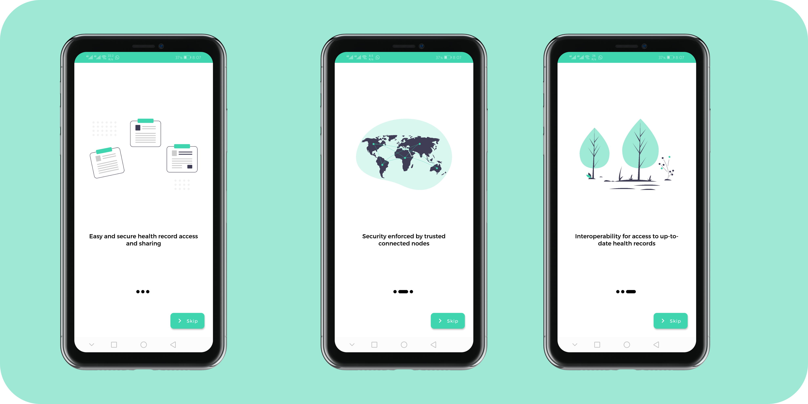
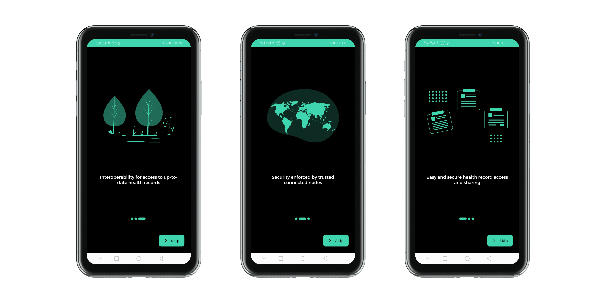
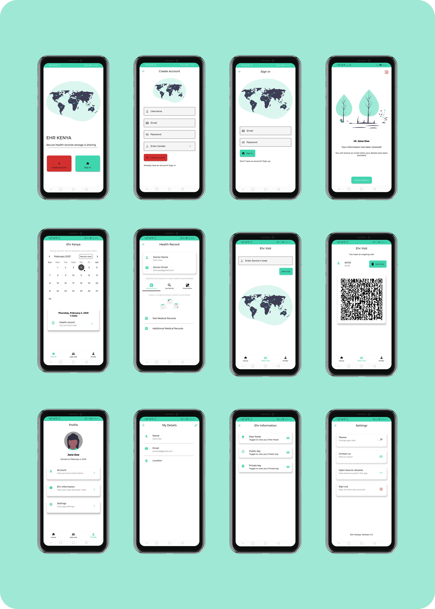
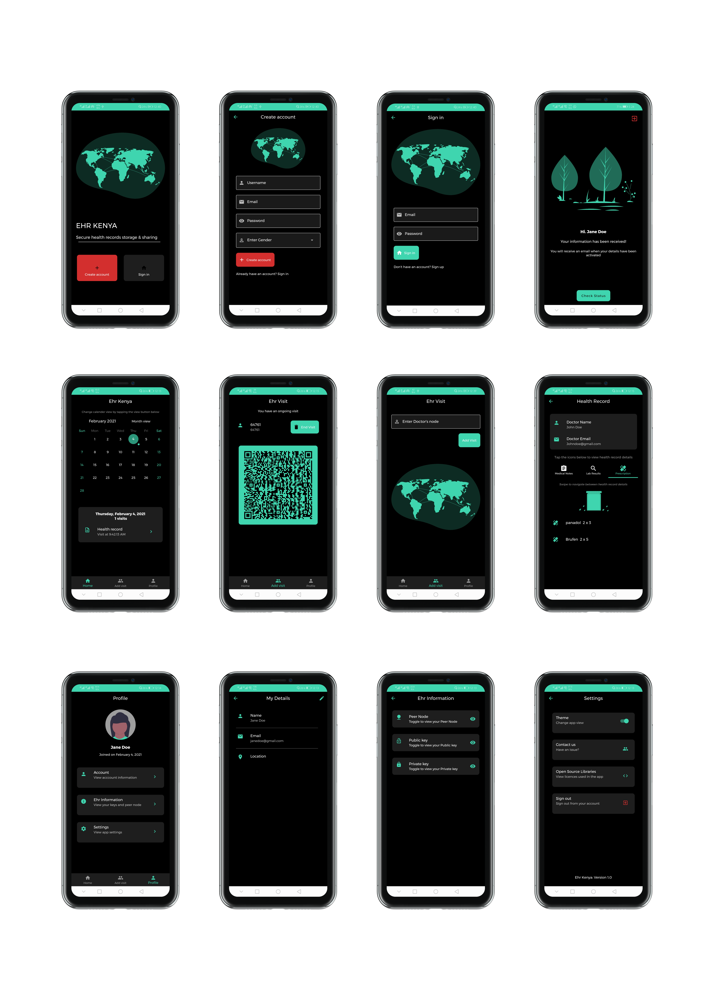
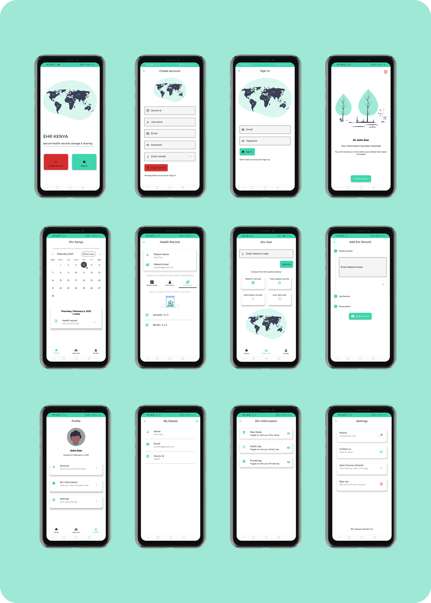
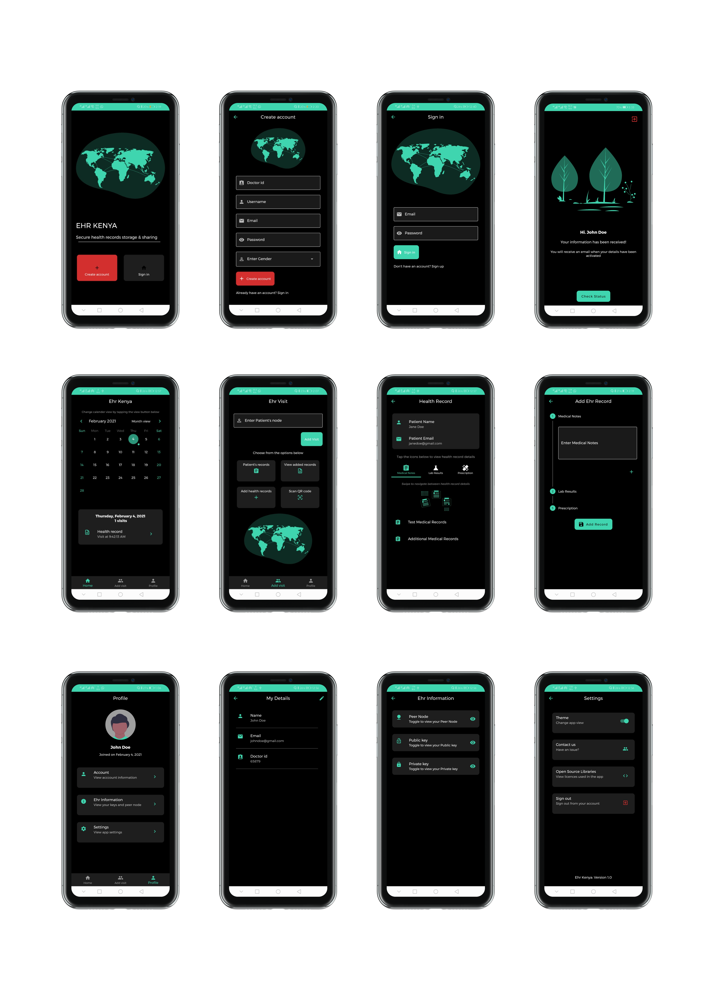

# EHR KENYA

Electronic Health Records Storage using Blockchain Technology

## Table of contents

- [Description](#description)
- [Onboarding Module](#onboarding-module)
- [Patient Module](#patient-module)
- [Doctor Module](#doctor-module)
- [Technologies](#technologies)
- [Requirements](#requirements)
- [Author Info](#author-info)

## Description

The system was created after identification of the challenges faced by health record storage systems in public hospitals in kenya.The EHR system was made to enhance interoperability in health record systems, improve how health records are shared and accessed in kenyan public hospitals and finally increasing the security of health records.

## Onboarding Module

The onboarding screens for new users and doctors

Light Mode

Dark Mode

## Patient Module

The screens for patient interaction in the application

Light Mode

Dark Mode

## Doctor Module

The screens for doctor interaction in the application

Light Mode

Dark Mode

### Technologies

- Python: For the blockchain and the API
- Flutter: Frontend for doctor and patient modules
- Figma: Prototyping UI mockups.
- Vscode : Coding

### Requirements

- [Requirements.txt](blockchain/requirements.txt) file contains all the packages that were used in creating of the blockchain and the api
- The [Doctor's Pubspec.yaml](doctor/pubspec.yaml) file contains all the dependencies that were used in creating of the doctor's application
- The [Patient's Pubspec.yaml](patient/pubspec.yaml) file contains all the dependencies that were used in creating of the patient's application

## Author Info

- Name: Cosmas Nyairo
- Website: <https://cosmasnyairo.herokuapp.com>
- Email : nyairocosmas@gmail.com
